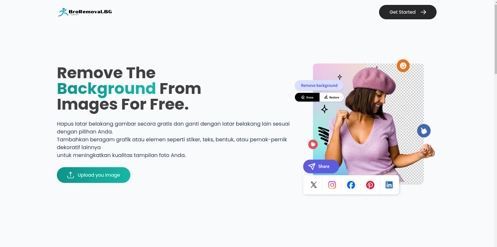

# [BroRemoval.bg](https://remotbg.vercel.app/)

#### [View Live Version!](https://remotbg.vercel.app/) - Bro Removal.bg

# Introduction:
Remove The Background From Images For Free Hapus latar belakang gambar secara gratis dan ganti dengan latar belakang lain sesuai dengan pilihan Anda.
Tambahkan beragam grafik atau elemen seperti stiker, teks, bentuk, atau pernak-pernik dekoratif lainnya
untuk meningkatkan kualitas tampilan foto Anda.

* Hosting - [Heroku](https://www.heroku.com/) - Free Tier
* Hosting - [Vercel](https://www.vercel.app/) - Free hosting

## Setup

2. Backend - NodeJS Express
   * `https://github.com/Ibeddocs/BroRemoval.bg.git`
   * `npm install`
   * `cd client`
   * `npm run dev`
     

Happy coding!

# React + Vite

This template provides a minimal setup to get React working in Vite with HMR and some ESLint rules.

Currently, two official plugins are available:

- [@vitejs/plugin-react](https://github.com/vitejs/vite-plugin-react/blob/main/packages/plugin-react/README.md) uses [Babel](https://babeljs.io/) for Fast Refresh
- [@vitejs/plugin-react-swc](https://github.com/vitejs/vite-plugin-react-swc) uses [SWC](https://swc.rs/) for Fast Refresh
